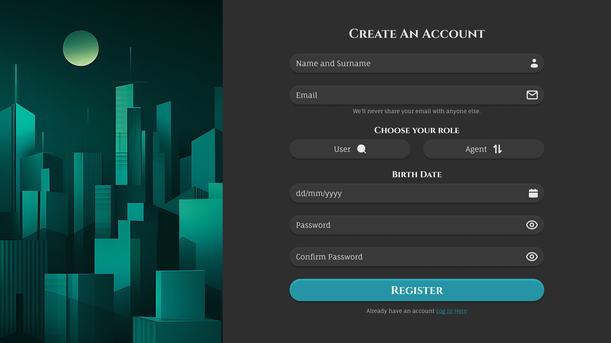
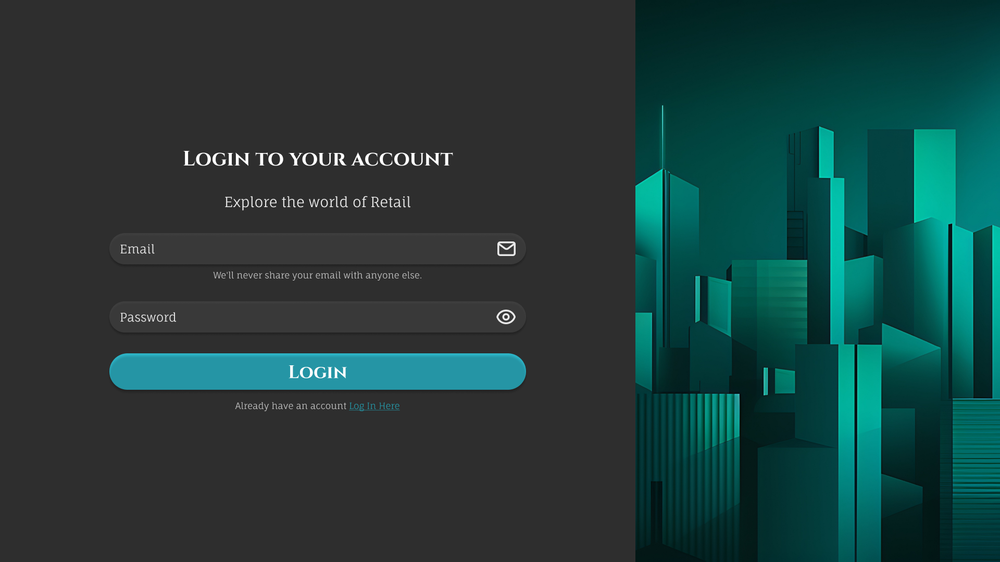
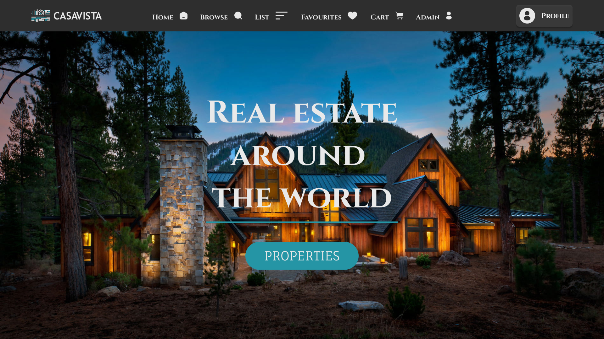

- - - -

## Table of Contents

1. [About CasaVista](#about-casavista)
2. [Built With](#built-with)
3. [How To Install](#how-to-install)
   - [Step 1: Clone the Repository](#step-1-clone-the-repository)
   - [Step 2: Setting Up the Environment](#step-2-setting-up-the-environment)
   - [Step 3: Running the Project](#step-3-running-the-project)
   - [Step 4: Additional Notes](#step-4-additional-notes)
4. [Features](#features)
5. [The Idea](#the-idea)
6. [Development Process](#development-process)
   - [Highlights](#highlights)
   - [Challenges](#challenges)
7. [Future Implementations](#future-implementations)
8. [Mockups](#mockups)
   - [Register Mockup](#register-mockup)
   - [Login Mockup](#login-mockup)
   - [Home Mockup](#home-mockup)
9. [Demonstration](#demonstration)
10. [License](#license)
11. [Author](#author)
12. [Contact](#contact)
13. [Acknowledgements](#acknowledgements)

- - - -

# About CasaVista

CasaVista is a retail site where you can purchase properties or even list your own properties. The UI is simple to understand and very functional. On CasaVista, you can choose your dream property.

### Built With
[](https://www.php.net/docs.php)
[](https://www.php.net/docs.php)
[](https://html.spec.whatwg.org/multipage/)
[](https://developer.mozilla.org/en-US/docs/Web/CSS)
[](https://www.javascript.com/)
[](https://getbootstrap.com/)
[](https://www.php.net/docs.php)


## How To Install

### Step 1: Clone the Repository

To get started, clone the repo:
```bash
git clone https://github.com/JoshuaDeKlerk/CasaVista.git
```

### Step 2: Setting Up the Environment

1. **Install XAMPP:**
   - Download and install XAMPP from [Apache Friends](https://www.apachefriends.org/index.html).
   - Ensure that both Apache and MySQL modules are running in the XAMPP Control Panel.

2. **Move Project Files:**
   - Navigate to your XAMPP installation directory (e.g., `C:\xampp\htdocs` on Windows or `/Applications/XAMPP/htdocs` on macOS).
   - Copy the entire project folder to the `htdocs` directory. 
   - Rename the project folder to `CasaVista`

3. **Create the database**
- Open your browser and go to [phpMyAdmin](http://localhost/phpmyadmin).
- In phpMyAdmin, click on the "New" button in the sidebar to create a new database.
- Name your database `casavista` and click "Create."

4. **Import the Database Structure**

- With the `casavista` database selected, click on the "Import" tab.
- Click the "Choose File" button and navigate to the `db` folder within your project directory.
- Select the `casavista.sql` file and click "Go" to import the database structure and initial data.

### Step 3: Running the Project

1. **Configure Database Connection:**
- In the `server.php` file located in the root of your project directory, update the database connection settings:
```php
    $hostname = "localhost";
    $dbUser = "root";
    $dbPassword = "";
    $dbName = "casavista";
```

2. **Access the Website:**
-   Open your browser and go to http://localhost/CasaVista.

### Step 4: Additional Notes
- Ensure that the `server.php` file is correctly configured with your database credentials.
- If there are any issues with permissions, make sure to adjust the folder permissions in the XAMPP `htdocs` directory.

## Features

| Page                  | Description                                        |
| --------------------- | -------------------------------------------------- |
| Register Page           | - Allows all users to create a account          |
|                       | - Allows users to choose between `user` and `agent`  |
|                       | - Allows users to be saved to the database   |
| Login Page           | - Allow users to sign into their account to access the website         |
| Home Page             | - Allows users to access the navigation      |
|                       | - Agents and `admins` can see more detailed pages
|                       | - Can access the settings page and logout |
| Browse Page       | - Allows users to see all the properties listed |
|                       | -Users can `filter` the properties|
| List Page      | - Allows agents and admins to list a property to the website              |
|                       | - Enables agents too chose what type of property it is. |
| Favorites Page      | - Allows users too favorite their most liked properties          |
| Admin Page      | - Allows admins to see properties agents want to ad to the website          |
|                       | - Admins can choose to `View`, `Approve` or `Delete` the property |
| Individual Page  | - Allows users to see the properties details        |
|                       | - Provides the ability to buy the property |
| Settings Page  | - Allows users to change their details        |

## The Idea

The idea was to create a rental website where users can post houses or apartments to sell. It should be easy for users to find their dream home and it should be a website where agents can easily list homes for sale. The site should have secure security to make sure nobody lists a property that should not be listed.

### Register Page


### Login Page


### Create a Post Page



## Development Process

### Highlights
* Highlights of the website is the simplistic UI and the functionality that gives the user a pleasant user experience.
* The website is easy to understand and navigate.

### Challenges
* Getting all the backend to work and when styling some of the backend would break so i would need to go back to fix the backend the whole time.
* Building the website in such a way that everything is automated, from automatically creating user profiles and displaying only their own properties. The browse page had to show all the properties that where added.

## Future Implementations

* Allow Users to view other user Profiles
* Allow functionality that will show whether the property was sold or not.

## Mockups

### Register Mockup


### Login Mockup


### Home Mockup


## Demonstration
[Link To Demonstration Video](https://drive.google.com/drive/folders/1gek3j6g_WJgM0EDlCRWWWeSuR6lbve7C?usp=sharing)

### License
[MIT](LICENSE) © Joshua De Klerk

## Author

- **Joshua De Klerk** - [Github](https://github.com/JoshuaDeKlerk)

## Contact

- **Joshua De Klerk** - [231204@virtualwindow.co.za](mailto:231204@virtualwindow.co.za)
- **Project Link** - https://github.com/JoshuaDeKlerk/CasaVista

## Acknowledgements

- [Stack Overflow](https://stackoverflow.com/)
- [Figma](https://www.figma.com/)
- [Lecturer](https://github.com/TsungaiKats)
- [Adobe Stock](https://stock.adobe.com/za/)