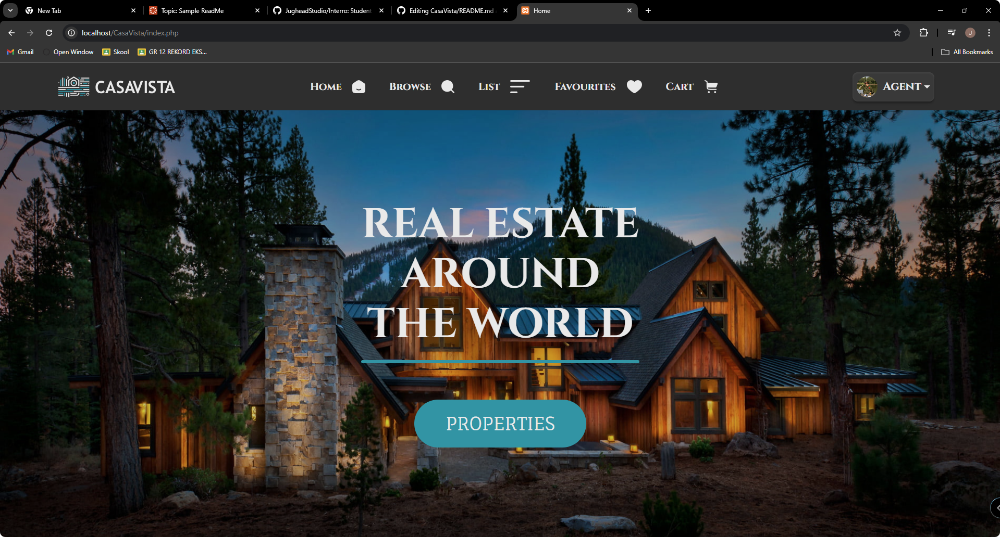

- - - -

# About CasaVista

CasaVista is a retail site where you can purchase properties or even list your own properties. The UI is simple to understand and very functional. On CasaVista, you can choose your dream property.

### Built With
[](https://www.php.net/docs.php)
[](https://www.php.net/docs.php)
[](https://html.spec.whatwg.org/multipage/)
[](https://developer.mozilla.org/en-US/docs/Web/CSS)
[](https://www.javascript.com/)
[](https://getbootstrap.com/)
[](https://www.php.net/docs.php)



## How To Install

### Step 1: Clone the Repository

To get started, clone the repo:
```bash
git clone https://github.com/JoshuaDeKlerk/CasaVista.git
```

### Step 2: Setting Up the Environment

1. **Install XAMPP:**
   - Download and install XAMPP from [Apache Friends](https://www.apachefriends.org/index.html).
   - Ensure that both Apache and MySQL modules are running in the XAMPP Control Panel.

2. **Move Project Files:**
   - Navigate to your XAMPP installation directory (e.g., `C:\xampp\htdocs` on Windows or `/Applications/XAMPP/htdocs` on macOS).
   - Copy the entire project folder to the `htdocs` directory. 
   - Rename the project folder to `CasaVista` (or any other name you prefer).

3. **Create the database**
- Open your browser and go to [phpMyAdmin](http://localhost/phpmyadmin).
- In phpMyAdmin, click on the "New" button in the sidebar to create a new database.
- Name your database (e.g., `casavista`) and click "Create."

4. **Import the Database Structure**

- With the `casavista` database selected, click on the "Import" tab.
- Click the "Choose File" button and navigate to the `db` folder within your project directory.
- Select the `casavista.sql` file and click "Go" to import the database structure and initial data.

### Step 3: Running the Project

1. **Configure Database Connection:**
- In the `server.php` file located in the root of your project directory, update the database connection settings:
```php
    $hostname = "localhost";
    $dbUser = "root";
    $dbPassword = "";
    $dbName = "casavista";
```

2. **Access the Website:**
-   Open your browser and go to http://localhost/CasaVista.

### Step 4: Additional Notes
- Ensure that the `server.php` file is correctly configured with your database credentials.
- If there are any issues with permissions, make sure to adjust the folder permissions in the XAMPP `htdocs` directory.